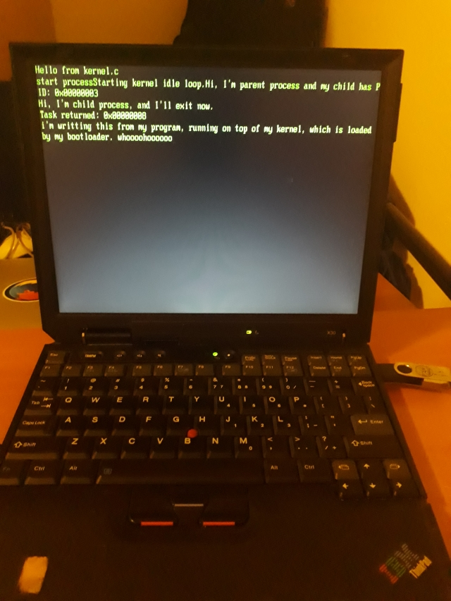

# AI powered bootloader and OS kernel for x86

##### A breath of fresh air in the ever expanding world of smart things.

Kernel has very advanced memory allocation algorithm.
It has no memory leaks, or any other resource leaks.
Also, uses alien technology for scheduling tasks.
Security mechanisms are impenetrable, which is no surprise,
given that technology is stolen from NSA, with help from Russian hackers.

_Now really:_

I just wanted to go beyond OS theory and tried to implement some of low level OS stuff from scratch. Emphasis was on **interaction with hardware** and basic concepts (like: **how to run multiple programs and handle IO**), not architecture design, algorithms and other high level stuff. That is why bootloader was beginning. As a product of play, this kernel ended up being spaghetti code mess, that could use some overhaulin'.

An old laptop was used for testing, no Bochs or other emulators. Yea, that is hard core mazohism. Using only prints, exception handlers, Intel manuals and thinking for debugging purposes.
But it was fun learning experience! Highly recommended for anyone to try. :D

## Implemented:

* bootloader
* protected mode
* paging
* interrupts
* preemptive multitasking
* user-mode
* running user program - **blocking** IO syscalls included

###### Syscalls:
* putc
* puts
* puthex
* getc
* fork
* exit

## Demo user program

In `usr/` directory is mini wrapping C library with example user program in main.c. It forks, making child process, prints to screen and accepts input from keyboard.

## Get started

The OS is developed under Ubuntu 18.04, but other Linux operating systems should work too.
If you are not using Debian based system then you should adapt commands for installing tools and software (if you are not using apt but rpm for example).

### Installing tools

* `# apt-get install build-essential`
* `# apt-get install nasm`

### Building bootloader and installing

To compile bootloader:

`make boot.bin`

To install bootloader to some device (for example USB):

`./write-mbr.sh /dev/sdb`

Here /dev/sdb is optional, and default value is /dev/sdb.

**Caution**: this will overwrite contents of master boot record, including partition table, which means you want be able to access partitions of you drive afterwards.
Old content of MBR sector is saved to _mbr-backup.bin_. Use it your own risk, and don't use it with USB drive that holds important information.

To compile kernel:

`make`

To install kernel to some device (for example USB):

`./write-kernel.sh /dev/sdb`

Here /dev/sdb is optional, and default value is /dev/sdb.

**Caution**: this will overwrite contents of first 32 sectors of you USB drive.
Old content of sectors are saved to _kernel-sectors-backup.bin_.

**_User program is bundled with kernel, copied to pages mapped to user memory and automatically ran._**

## Credits

[OSDev wiki](https://wiki.osdev.org/)

[Intel software developer manual](https://software.intel.com/en-us/articles/intel-sdm)

[osdever.net](http://www.osdever.net/)

[JamesM' osdev tutorials](http://www.jamesmolloy.co.uk/tutorial_html/9.-Multitasking.html)

...and also StackOverflow, GitHub, Wikipedia....
